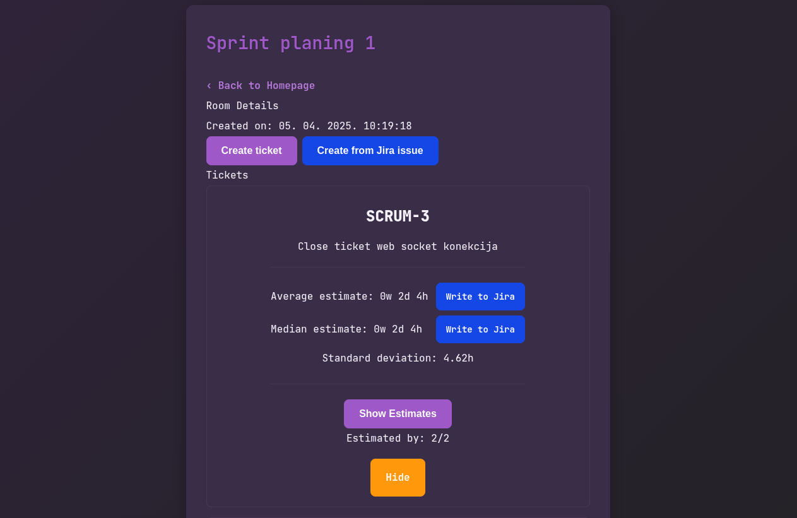

# Sprint belote

A lightweight, opinionated sprint estimation tool built with Go.

## Features

- No Login Required: Anonymous participation for quick setup
- Real-time Updates: Instantly see new tickets and estimations using [HTMX](https://htmx.org/)
- Time-based Estimation: Estimate in weeks, days, and hours instead of story points
- Blind Estimation: View the team's average only after submitting your own estimate
- Simple Room Management: Create rooms, add tickets, and close them when estimates are complete
- Jira Integration
  - Import tickets from Jira
  - Write estimates directly in Jira

## Technology Stack

- Backend: Go
- Database: PostgreSQL with [Gorm](https://gorm.io/)
- Frontend:
  - [Templ](https://templ.guide/) for HTML templating
  - [HTMX](https://htmx.org/) for dynamic interactions without JavaScript
  - [Tailwind CSS](https://tailwindcss.com/) for styling
  - Custom web components
